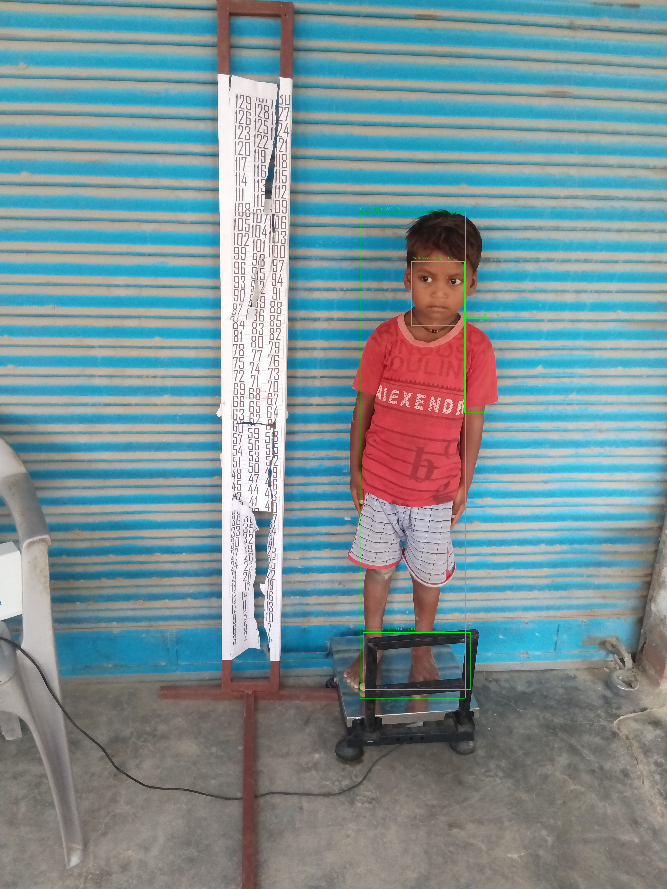

# Child Growth Monitor Project

## Description

This project is a part of the Child Growth Monitor system, which aims to track and monitor the growth of children using bounding box images and XML annotations.

The `save_bounding_box_images` script takes an input image and its corresponding XML annotation, extracts bounding box information from the XML, crops the bounding box area from the image, and saves it as a separate image.

## Requirements

- Python 3.x
- PIL (Python Imaging Library)
- xml.etree.ElementTree

## Usage

1. Place your images and XML annotation files in the appropriate directories.
2. Update the paths of the `image_path`, `xml_path`, and `output_path` variables in the script.
3. Run the script using the following command:python app.py

5. The cropped bounding box images will be saved in the specified output folder.

## Directory Structure
Child_Growth_Monitor/
├── test/
│ ├── 2023-05-29_IMG_1685356462189.jpg
├── xml_files/
│ ├── 2023-05-29_IMG_1685356462189.xml
├── app.py
├── image_boundig/
│ ├── sample_class_100_200_300_400.jpg
│ ├── ...
├── README.md

## Notes

- Make sure to install the required libraries using `pip install pillow`.
- The provided script is a basic example. Depending on your project's requirements, you might need to add error handling and additional functionalities.
- Feel free to customize this README according to your project's specifics.

## License

This project is licensed under the [MIT License](LICENSE).

